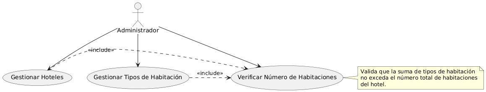

# DOCUMENTACIÓN DEL MÓDULO ADMINISTRATIVO "HOTELS-SYSTEM"

## DESCRIPCIÓN GENERAL
"Hotels-System" es un módulo administrativo web para gestionar hoteles, desarrollado con un backend en Laravel 12 y un frontend en React, conectado a una base de datos PostgreSQL. Este sistema permite a los administradores crear, leer, actualizar y eliminar (CRUD) hoteles y sus tipos de habitación, con una validación que asegura que la suma de las cantidades de tipos de habitación no exceda el número total de habitaciones definido para cada hotel. Actualmente, está diseñado como un módulo interno para administradores, sin interacción directa con clientes.

## ACTORES
- Administrador: Gestiona hoteles y tipos de habitación (CRUD).

## DIAGRAMA UML: CASOS DE USO
A continuación, se describe el diagrama UML de casos de uso que representa las interacciones del Administrador con el sistema. El diagrama está disponible en la imagen "diagrama-uml.png" en la carpeta raíz del proyecto (hotels-system/). Pegue o inserte la imagen aquí si está editando este documento en un editor como Word o Markdown.

Código PlantUML (para referencia o regeneración del diagrama):

```
@startuml
actor Administrador

Administrador --> (Gestionar Hoteles)
Administrador --> (Gestionar Tipos de Habitación)
Administrador --> (Verificar Número de Habitaciones)

(Gestionar Hoteles) .> (Verificar Número de Habitaciones) : <<include>>
(Gestionar Tipos de Habitación) .> (Verificar Número de Habitaciones) : <<include>>

note right of (Verificar Número de Habitaciones)
Valida que la suma de tipos de habitación
no exceda el número total de habitaciones
del hotel.
end note
@enduml
```


## Diagrama UML:


## CASOS DE USO DETALLADOS
| Caso de Uso                  | Actor         | Descripción                                                                 | Precondiciones                     | Postcondiciones                       |
|------------------------------|---------------|-----------------------------------------------------------------------------|------------------------------------|---------------------------------------|
| Gestionar Hoteles            | Administrador | CRUD de hoteles.                                                           | Admin autenticado.                | Hotel actualizado en la BD.          |
| Gestionar Tipos de Habitación| Administrador | CRUD de tipos de habitación por hotel.                                     | Hotel existe, admin autenticado.  | Tipos actualizados en la BD.         |
| Verificar Número de Habitaciones | Administrador | Valida que la suma de tipos no exceda el total del hotel.             | Cambio en hotel o tipos.          | Operación validada o rechazada.      |

## REQUISITOS FUNCIONALES
- RF1: CRUD de hoteles por administradores.
- RF2: CRUD de tipos de habitación por hotel.
- RF3: Validación del número de habitaciones.

## REQUISITOS NO FUNCIONALES
- RNF1: Accesible vía navegador.
- RNF2: Operaciones CRUD en < 2 segundos.
- RNF3: Usa PostgreSQL.
- RNF4: Evita 502 Bad Gateway con puerto dinámico y timeouts adecuados.

## ESTRUCTURA DEL PROYECTO
- backend/: Laravel 12, PHP 8.2, lógica administrativa y base de datos.
- frontend/: React con Vite, interfaz administrativa.

## INSTRUCCIONES DE DESPLIEGUE
Local:
- Backend:
  1. Clonar: `git clone https://github.com/nsrc008/hotels-system.git`.
  2. Entrar: `cd backend`.
  3. Dependencias: `composer install`.
  4. Configurar `.env`:
```
DB_CONNECTION=pgsql
DB_HOST=127.0.0.1
DB_PORT=5432
DB_DATABASE=hotel_db
DB_USERNAME=postgres
DB_PASSWORD=<tu_contraseña>
```
5. Migraciones: `php artisan migrate`.
6. Iniciar: `php artisan serve`.

- Frontend:
1. Entrar: `cd frontend`.
2. Dependencias: `npm install`.
3. `.env.development`:
```
VITE_API_URL=http://localhost:8000/api
```
4. Iniciar: `npm run dev`.

## NOTAS TÉCNICAS
- Validación: Trigger en PostgreSQL para el número de habitaciones.
- CORS: Configurado en `config/cors.php`.
- 502 Bad Gateway: Resuelto con `$PORT`, `0.0.0.0`, y Timeout 120.